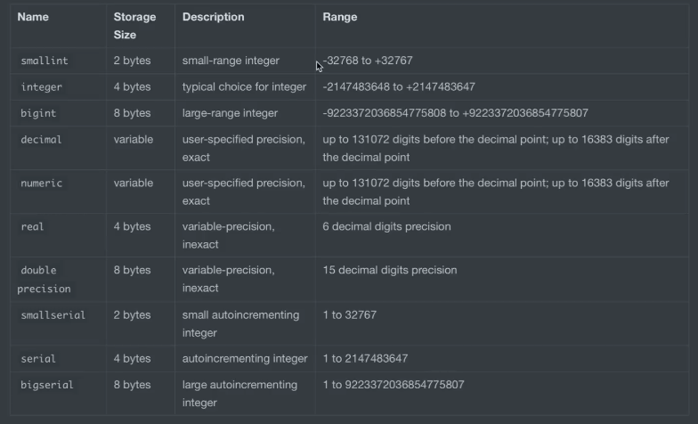

# PostgreSQL con Docker

## Creación del Contenedor
```bash
docker run -d --name postgres_container -e POSTGRES_USER=admin -e POSTGRES_PASSWORD=admin -e POSTGRES_DB=campus -p 5433:5432 -v pgdata:/var/lib/postgresql/data --restart=unless-stopped postgres:15
```

## Conectar al contenedor
```bash
docker exec -it postgres_container bash
```

## Conectar con PostgreSQL bajo consola. Versión larga-Versión corta
```bash
psql --host=localhost --username=admin -d campus --password

psql -h localhost -U admin -W admin -d campus
```

## Tipos de datos PostgreSQL


## Enumeradores
```pgsql
CREATE TYPE sexo AS ENUM('Masculino', 'Femenino', 'Otro');

CREATE TABLE camper(
    name VARCHAR(100) NOT NULL,
    sexo_camper sexo NOT NULL
);
```

## Comandos PSQL
- `\l`: Listar bases de datos
- `\c <db_name>`: Cambiar a una base de datos existente
- `CREATE DATABASE <nombre>`: Crear una base de datos